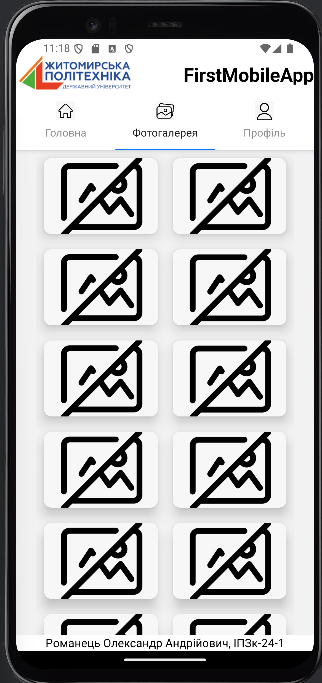
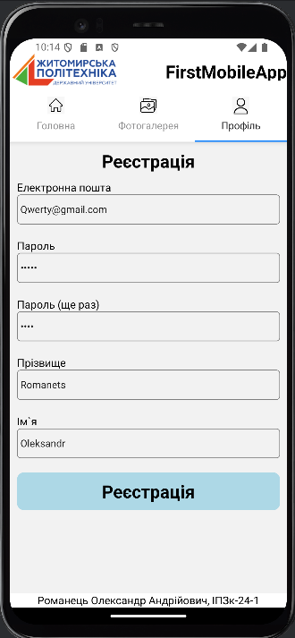
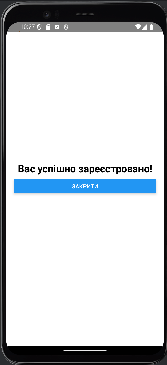

# Лабораторна 1
## Встановлення та запуск:
### спочатку потрібно склонувати проєкт:
git clone https://github.com/kerosene2562/MobileLabsRN2025
### Встановити залежності
Node.js
npm install @react-navigation/native
npx expo install react-native-screens react-native-safe-area-context
### Запустити проєкт
npm run android
### якщо проєкт не запустився сам, потрібно в терміналі натиснути кнопку 'a'

## Головна сторінка:

## Галерея:

## Сторінка профілю:

## При натисканні на кнопку *реєстрація* з'являється модульне вікно

