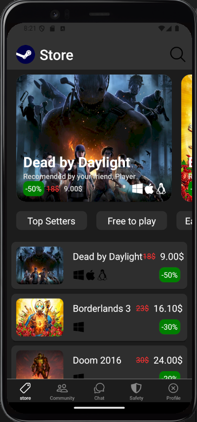
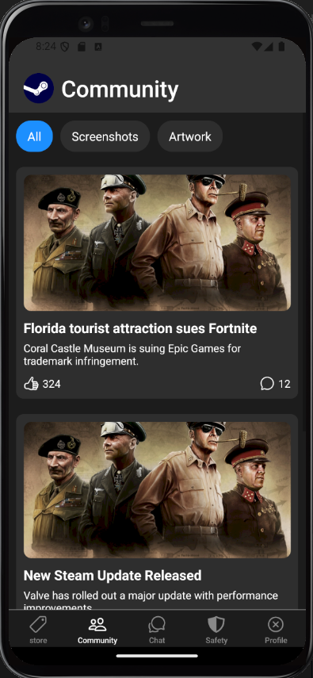
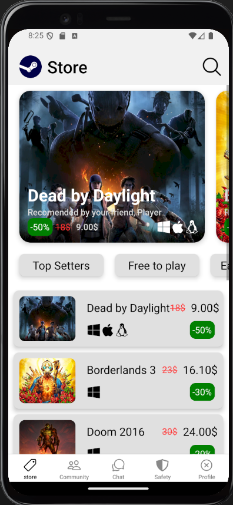
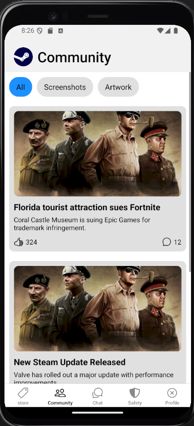

# Інструкція для встановлення та запуску React Native додатку

1. **Клонування репозиторію**
    ```bash
    git clone https://github.com/kerosene2562/MobileLabsRN2025.git
    ```

2. **Встановлення залежностей**
    ```bash
    npm install
    ```

3. **Налаштування середовища для Android**
    - Відкрийте Android Studio та імпортуйте проект.

## Запуск додатку

```bash
npx react-native run-android
```

## Загальний вигляд додатку

## Головна сторінка (темна тема)



## Вкладинка ком'юніті (темна тема)



## Головна сторінка (світла тема)



## Вкладинка ком'юніті (світла тема)

